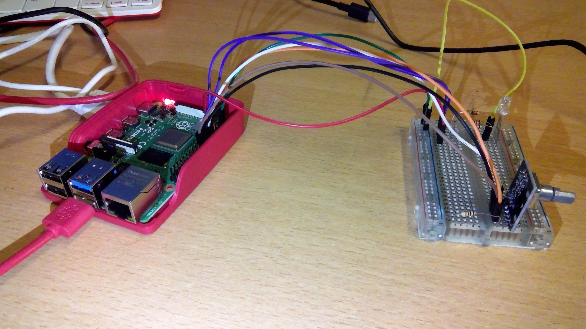

import markdown

# Rotary Encoder RGB LED Controller for Raspberry Pi

## Project Overview

This project demonstrates the use of a rotary encoder and a 4-legged RGB LED connected to a Raspberry Pi. The rotary encoder is used to adjust the brightness of individual colors (Red, Green, and Blue) of the LED. The encoder’s button is used to switch between colors. The brightness can be increased or decreased by rotating the encoder, and the current brightness values are updated on the RGB LED.

### Hardware Requirements
- Raspberry Pi 4 (or similar)
- 4-legged RGB LED (common anode or common cathode)
- Rotary encoder with push button (e.g., HW-040)
- Breadboard and jumper wires
- Resistors (220Ω recommended for each LED leg)
- Python 3 environment with necessary libraries

possible circuit wiring


### Software Requirements
- Python 3
- `lgpio` library for GPIO control
- Git for version control

## Goal

The goal of this project is to create a circuit and develop a Python program that allows users to control the brightness of an RGB LED using a rotary encoder. The button on the encoder is used to switch between Red, Green, and Blue colors, and the encoder’s rotation adjusts the brightness of the selected color.

## Setup Instructions

### 1. Wiring the Hardware

The components should be wired to the Raspberry Pi's GPIO pins as follows:

- **RGB LED**:
  - Red leg → GPIO 17 (with a resistor)
  - Green leg → GPIO 27 (with a resistor)
  - Blue leg → GPIO 22 (with a resistor)
  - Common leg (anode/cathode) → Ground or VCC depending on LED type

- **Rotary Encoder**:
  - Pin A → GPIO 23
  - Pin B → GPIO 24
  - Button pin → GPIO 25
  - GND pin of the encoder → Ground on Raspberry Pi

### 2. Python Script

The Python script controls the RGB LED and listens to the rotary encoder events. The main functions of the code include:
- Rotating the encoder increases or decreases the brightness of the selected color.
- Pressing the encoder button switches between Red, Green, and Blue color channels.
- The current color values are printed to the console for debugging.

### 3. How to Run

1. Clone the repository to your Raspberry Pi:
   ```bash
   git clone https://github.com/your-repo-name/rotary-encoder-rgb-led.git
